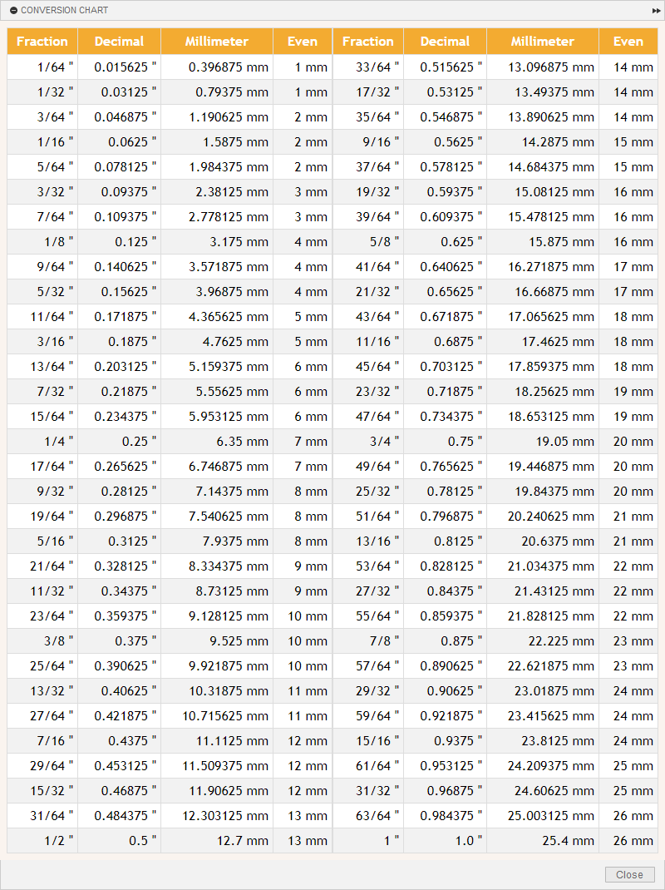

#  Fusion 360 - Conversion Chart
An add-in that displays a conversion chart in Autodesk Fusion 360.  Clicking on a value automatically copies it to your clipboard.

## Installation

Download and install the GitHub2Fusion360 add-in by [Jérôme Briot](https://github.com/JeromeBriot) ([Windows](https://apps.autodesk.com/FUSION/fr/Detail/Index?id=789800822168335025&appLang=en&os=Win64) or [Mac](https://apps.autodesk.com/FUSION/fr/Detail/Index?id=789800822168335025&os=Mac&appLang=en)) available for free on the Autodesk App Store.

Run the GitHub2Fusion360 add-in in Fusion 360 and copy/paste the URL of the repo: [https://github.com/BradAndersonJr/Fusion360-Conversion-Chart](https://github.com/BradAndersonJr/Fusion360-Conversion-Chart)

## Usage

Run the Conversion Chart add-in and you should see a new button with a orange icon () on the quick access toolbar on the upper right corner of the Fusion 360 UI.  Click on the button to toggle the visibility of the conversion chart palette.

## Version history

- 1.0 (Mar 26, 2020) - Initial Release

## Acknowledgements

This add-in uses the following JavaScript contribution:
* [Copy on Click](https://stackoverflow.com/questions/37478281/select-the-value-of-a-td-on-click-to-ease-copy) answer contributed by Viktor Koncsek

## License
Codes are licensed under the terms of the [GNU General Public License v3.0 License](https://www.gnu.org/licenses/gpl-3.0.en.html).  Please see the License.txt file for full details.